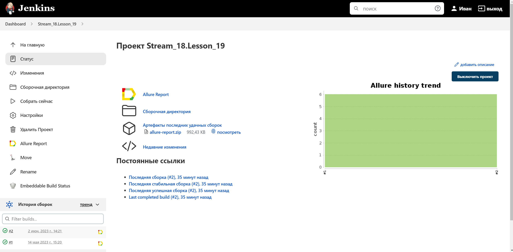
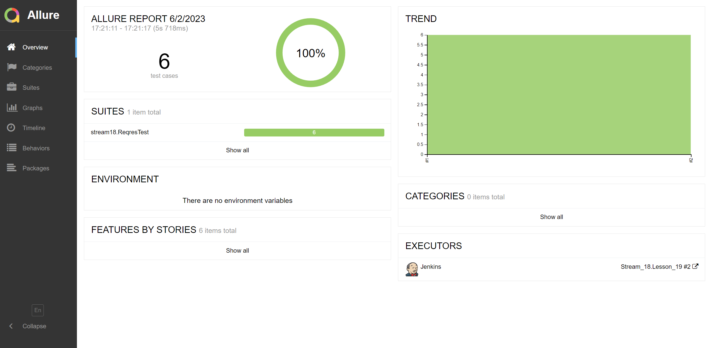
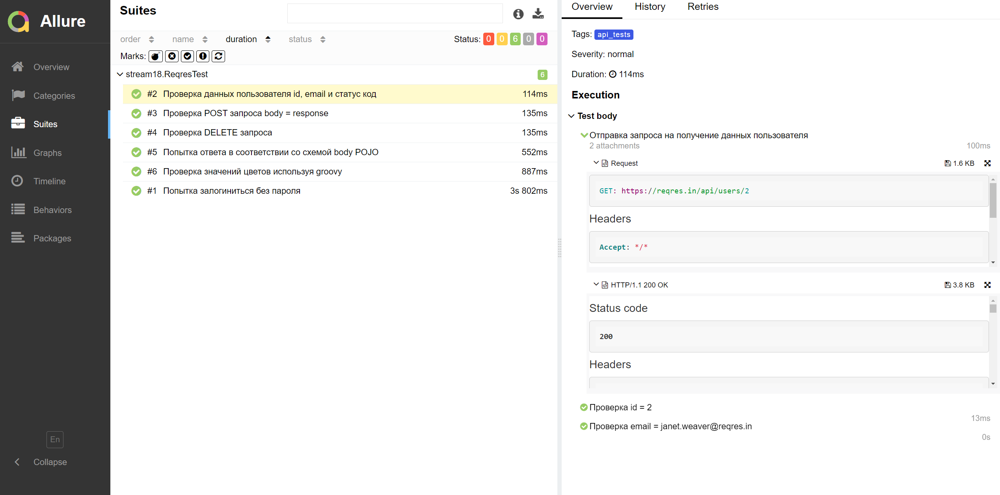

# Дипломный проект по тестированию API для [reqres.in](https://reqres.in/)
## :scroll: Содержание:

- [Используемый стек](#computer-используемый-стек)
- [Запуск автотестов](#arrow_forward-запуск-автотестов)
- [Сборка в Jenkins](#-сборка-в-jenkins)
- [Пример Allure-отчета](#-пример-allure-отчета)

## :computer: Используемый стек

<p align="center">


</p>

Тесты в данном проекте написаны на языке <code>Java</code>, сборщик - <code>Gradle</code>. Так же были использованы фреймворки <code>JUnit 5</code>.
Для удаленного запуска реализована джоба в <code>Jenkins</code> с формированием Allure-отчета.

Содержание Allure-отчета:
* Шаги теста;
* Полный вид отправки запроса;
* Полный вид полученного ответа;

## :arrow_forward: Запуск автотестов

### Запуск тестов из терминала
```
gradle clean api_tests
```

##  Сборка в Jenkins
<p align="center">

</p>

##  Пример Allure-отчета
### Overview

<p align="center">

</p>

<p align="center">

</p>
